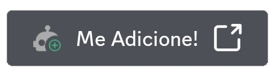

  

<h1>Bem-vindo ao PixeL 🚀</h1>

PixeL não é apenas mais um bot do Discord – é o seu melhor companheiro para gerenciamento de servidor, interação e diversão! Com um design elegante e recursos poderosos, o PixeL está aqui para levar sua experiência no Discord para o próximo nível.
 

<h2>Características 🎉</h2>

- **Interação**: Engaje-se com outros membros da comunidade de forma divertida e interativa usando os comandos de interação do PixeL! Desde abraços reconfortantes até elogios calorosos, há uma variedade de maneiras de criar laços e espalhar positividade em seu servidor. 🤝❤️
- **Jogos**: Divirta-se com a categoria de jogos do PixeL! Desafie seus amigos, teste suas habilidades e mergulhe em aventuras emocionantes com uma variedade de comandos de jogos. 🎮🎲
- **Economia**: Construa uma economia próspera em seu servidor com os recursos de economia do PixeL! Permita que os membros ganhem e gastem moedas virtuais, participem de jogos econômicos e interajam com a comunidade de uma maneira totalmente nova. Com o sistema de economia do PixeL, a diversão nunca para! 💰📈
- **Moderação**: Mantenha seu servidor seguro e organizado com os poderosos recursos de moderação do PixeL. Com ferramentas para gerenciar membros, moderar conteúdo e garantir um ambiente saudável, você pode ter tranquilidade sabendo que seu servidor está sob controle. 🛡️🔨
- **Utilitários**: Explore uma ampla gama de comandos utilitários para simplificar suas tarefas diárias e aprimorar sua experiência nos servidores. 🛠️🔍

<h2>Começando 🚀</h2>

Adicionar o PixeL ao seu servidor do Discord é rápido e fácil! Basta clicar no botão abaixo para convidar PixeL para o seu servidor e, posteriormente, utilizar suas funcionalidades: 

  

<h2>Sobre o PixeL ℹ️</h2>

PixeL nasceu em 04 de maio de 2023 (mais precisamente às 17h51min 🤓) e foi desenvolvido com Node.js e Discord.js. Nossa missão é fornecer às comunidades do Discord um bot versátil e confiável que aprimore as interações e simplifique o gerenciamento do servidor.
 

<h2>Ajude-nos a Manter o PixeL! 💖</h2>

Se você gosta de utilizar o PixeL e deseja ajudar a manter nosso bot funcionando, considere fazer uma doação! Sua contribuição nos ajuda a cobrir os custos de hospedagem e a desenvolver novos recursos para tornar sua experiência ainda melhor. Além disso, você pode votar no PixeL no top.gg para nos ajudar a crescer e alcançar mais usuários. Obrigado pelo seu apoio contínuo!

  
  

<h2>Termos de Uso e Serviço 📜</h2>

Ao adicionar o PixeL ao seu servidor do Discord, você concorda em cumprir os [Termos de Serviço do Discord](https://discord.com/terms) e os termos adicionais que estão listados nesse mesmo repositório do GitHub e podem ser encontrados em [ToS.md](https://github.com/emptydev1/PixeL/blob/main/ToS.md).

<h2>Contribuidores do Projeto 💻</h2>

Um grande obrigado a todos os nossos colaboradores que ajudaram a transformar o PixeL no que ele é hoje. Quer juntar-se a nossa equipe? Sinta-se à vontade para contribuir enviando pull requests ou relatando problemas no [GitHub](https://github.com/emptydev1/pixel).
